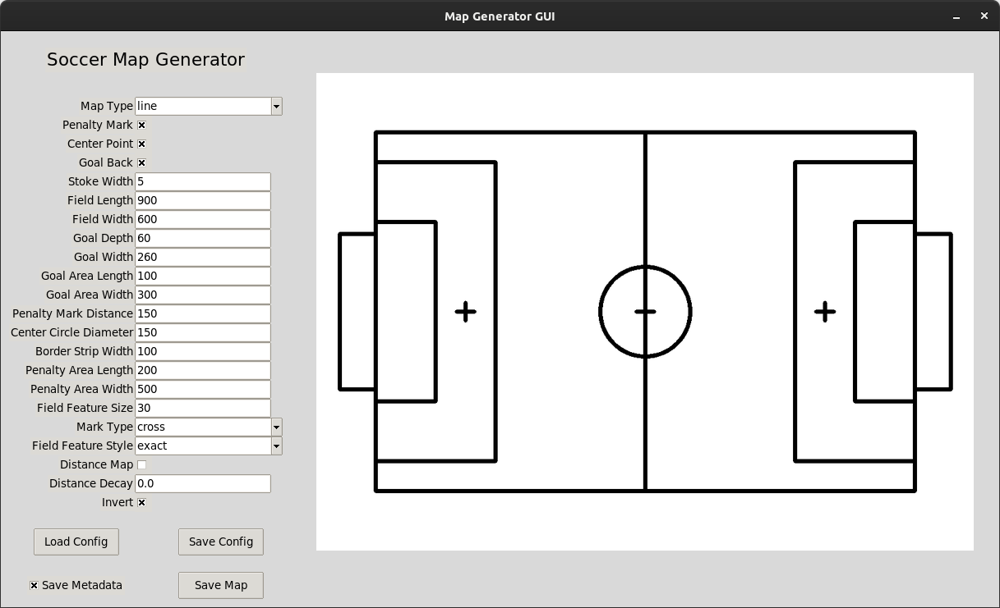

# Soccer Field Map Generator

[](../../actions/workflows/build_and_test_humble.yaml?query=branch:rolling)
[](../../actions/workflows/build_and_test_iron.yaml?query=branch:rolling)
[](../../actions/workflows/build_and_test_rolling.yaml?query=branch:rolling)

This repository contains a tool for generating soccer field maps. It includes a GUI for interactively creating and editing maps, as well as a command-line interface for scripted map generation.

## Installation

To install the tool, run the following commands in your colcon workspace:

```bash
git clone git@github.com:ros-sports/soccer_field_map_generator.git src/soccer_field_map_generator
rosdep install --from-paths src --ignore-src -r -y
colcon build
```

Don't forget to source your workspace after building:

```bash
source install/setup.bash
```

## Usage

### GUI

To launch the GUI, run the following command:

```bash
ros2 run soccer_field_map_generator gui
```

You should see a window like this:



### CLI

To generate a map using the command-line interface, run the following command:

```bash
ros2 run soccer_field_map_generator cli [output_file] [config_file] [options]
```
